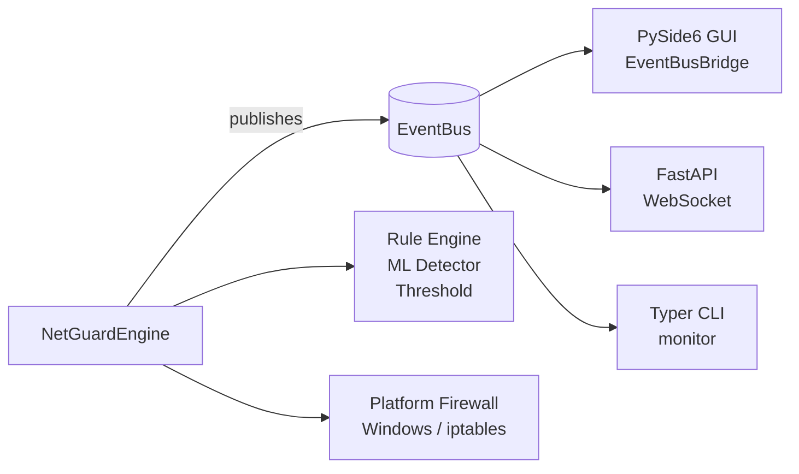

# NetGuard IDS

> **Advanced Firewall & Intrusion Detection System** with ML anomaly detection, YAML-driven detection rules, and three integrated frontends.

[](https://github.com/Armanrbu/Firewall-Configuration-and-Basic-Intrusion-Detection-System/actions)
[](https://www.python.org/)
[](LICENSE)

## What is NetGuard IDS?

NetGuard IDS monitors your network in real-time, detects intrusion attempts, and automatically blocks malicious IPs using platform-native firewall rules (Windows Firewall / iptables).

## Key Features

| Feature | Description |
|---------|-------------|
| 🔍 **Real-time monitoring** | psutil-based connection tracking with configurable thresholds |
| 🤖 **ML anomaly detection** | PyOD ECOD / scikit-learn IsolationForest with auto-retraining |
| 📋 **YAML rule engine** | Hot-reloadable detection rules with Python escape hatch |
| 🛡️ **GUI** | PySide6 tabbed interface with rule editor, alerts, blocklist, and threat map |
| ⌨️ **CLI** | Full-featured Typer CLI with Rich output, live monitoring, and auto-completion |
| 🌐 **REST API** | FastAPI + Uvicorn with WebSocket event streaming and OpenAPI docs |
| 🐳 **Docker** | Headless engine + REST API in a container via `docker compose up` |

## Quick Start

```bash
# Clone
git clone https://github.com/Armanrbu/Firewall-Configuration-and-Basic-Intrusion-Detection-System.git
cd Firewall-Configuration-and-Basic-Intrusion-Detection-System

# Install (GUI + API + CLI)
pip install -e ".[gui,api,cli]"

# Run GUI
python main.py

# Run headless (API only)
python main.py --headless

# Use the CLI
python -m cli --help
python -m cli status
python -m cli monitor

# Docker
docker compose up
```

## Architecture



All three frontends share a **single engine instance** via the `AppRunner` singleton and receive events through the publish/subscribe `EventBus`.

## Installation Options

```bash
# Minimum (engine only, headless, no GUI)
pip install netguard-ids

# With GUI
pip install "netguard-ids[gui]"

# With REST API
pip install "netguard-ids[api]"

# With CLI extras
pip install "netguard-ids[cli]"

# Everything
pip install "netguard-ids[all]"
```
